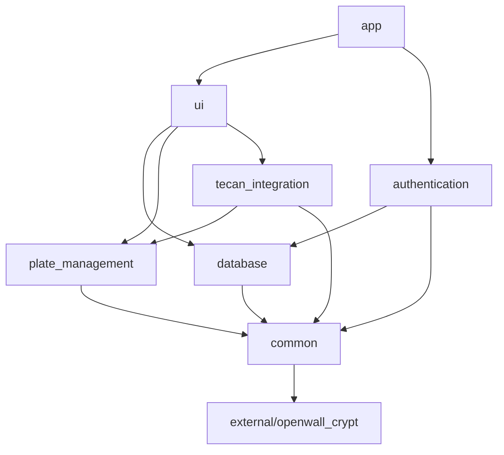

# Design Document

## Overview

This design document outlines the restructuring of the Invenesis laboratory automation Qt/C++ application from a flat file structure into a modular, well-organized architecture. The current project contains approximately 40+ source files in the root directory, making it difficult to maintain and understand. The new structure will organize files into logical functional modules with hierarchical CMake build system for improved maintainability and build efficiency.

## Architecture

### High-Level Module Organization

The project will be restructured into the following main modules:

```
Invenesisapp/
├── CMakeLists.txt                 # Root build configuration
├── app/                          # Main application entry point
│   ├── CMakeLists.txt
│   └── main.cpp
├── src/                          # Core application modules
│   ├── authentication/           # Login and user management
│   ├── database/                # Database connectivity and models
│   ├── ui/                      # Main UI windows and dialogs
│   ├── plate_management/        # Plate widgets and containers
│   ├── tecan_integration/       # Tecan-specific functionality
│   └── common/                  # Shared utilities and components
├── external/                    # Third-party libraries
│   └── openwall_crypt/         # Password hashing library
├── resources/                   # Application resources
│   ├── icons/                  # Icon files
│   ├── data/                   # JSON configuration files
│   └── ui/                     # Shared UI resources
└── build/                      # Build output directory
```

### Module Dependencies



## Components and Interfaces

### 1. Authentication Module (`src/authentication/`)

**Purpose:** Handle user login, password management, and authentication

**Files:**
- `logindialog.cpp/h` - Main login dialog
- `resetpassworddialog.cpp/h` - Password reset functionality
- `qtbcrypt.cpp/h` - Password hashing utilities

**CMake Target:** `authentication`

**Dependencies:** `common`, `external/openwall_crypt`, Qt::Widgets

### 2. Database Module (`src/database/`)

**Purpose:** Database connectivity, models, and data access layer

**Files:**
- `Database.h` - Database connection management
- `customproxymodel.cpp/h` - Custom proxy model for filtering
- `draggabletableview.cpp/h` - Enhanced table view with drag support

**CMake Target:** `database`

**Dependencies:** `common`, Qt::Sql, Qt::Widgets

### 3. UI Module (`src/ui/`)

**Purpose:** Main application windows and general dialogs

**Files:**
- `databaseviewwindow.cpp/h` - Main database view window
- `additemdialog.cpp/h` - Add item dialog
- `loadexperimentdialog.cpp/h` - Load experiment dialog
- `ClickableLabel.h` - Custom clickable label widget

**CMake Target:** `ui`

**Dependencies:** `database`, `common`, Qt::Widgets

### 4. Plate Management Module (`src/plate_management/`)

**Purpose:** Plate widgets, containers, and plate-related functionality

**Files:**
- `PlateWidget.cpp/h` - Base plate widget
- `PlateMapDialog.cpp/h` - Plate mapping dialog
- `Plate1536Dialog.cpp/h` - 1536-well plate dialog
- `matrixplatecontainer.cpp/h` - Matrix plate container
- `matrixplatewidget.cpp/h` - Matrix plate widget
- `daughterplatewidget.cpp/h` - Daughter plate widget

**CMake Target:** `plate_management`

**Dependencies:** `common`, Qt::Widgets

### 5. Tecan Integration Module (`src/tecan_integration/`)

**Purpose:** Tecan-specific functionality, GWL generation, and automation

**Files:**
- `tecanwindow.cpp/h` - Main Tecan interface window
- `gwlgenerator.cpp/h` - GWL file generation
- `generategwldialog.cpp/h` - GWL generation dialog
- `standardlibrary.cpp/h` - Standard library management
- `standardselectiondialog.cpp/h` - Standard selection dialog

**CMake Target:** `tecan_integration`

**Dependencies:** `plate_management`, `database`, `common`, Qt::Widgets

### 6. Common Module (`src/common/`)

**Purpose:** Shared utilities, base classes, and common functionality

**Files:**
- Common utility functions
- Shared constants and enumerations
- Base widget classes (if any emerge during refactoring)

**CMake Target:** `common`

**Dependencies:** Qt::Core, Qt::Widgets

### 7. External Libraries (`external/`)

**Purpose:** Third-party libraries and dependencies

**Subdirectories:**
- `openwall_crypt/` - Password hashing library (existing)

**CMake Target:** `openwall_crypt`

**Dependencies:** None (pure C library)

### 8. Resources (`resources/`)

**Purpose:** Application resources organized by type

**Structure:**
- `icons/` - All PNG icon files
- `data/` - JSON configuration files
- `ui/` - Shared UI resources and stylesheets

## Data Models

### CMake Target Structure

Each module will have its own CMake target with clear dependencies:

```cmake
# Example module CMakeLists.txt structure
add_library(module_name STATIC
    ${SOURCES}
    ${HEADERS}
    ${FORMS}
)

target_link_libraries(module_name
    PUBLIC Qt${QT_VERSION_MAJOR}::Widgets
    PRIVATE dependency_modules
)

target_include_directories(module_name
    PUBLIC ${CMAKE_CURRENT_SOURCE_DIR}
    PRIVATE ${CMAKE_CURRENT_SOURCE_DIR}/private
)
```

### UI Form Organization

UI forms (.ui files) will be placed alongside their corresponding source files within each module. The CMake configuration will handle Qt's UIC compilation automatically through `CMAKE_AUTOUIC`.

### Resource Management

The `resources.qrc` file will be updated to reflect the new directory structure, with resources organized by category:

```xml
<RCC>
    <qresource prefix="/icons">
        <file>resources/icons/ajouter.png</file>
        <!-- ... other icons ... -->
    </qresource>
    <qresource prefix="/data">
        <file>resources/data/standards_matrix.json</file>
        <file>resources/data/volumeMap.json</file>
    </qresource>
</RCC>
```

## Error Handling

### Build System Error Handling

1. **Missing Dependencies:** Each CMakeLists.txt will check for required Qt components and fail gracefully with clear error messages
2. **Circular Dependencies:** The module dependency graph is designed to be acyclic
3. **Missing Files:** CMake will validate that all source files exist before attempting to build

### Migration Error Handling

1. **File Conflicts:** The restructuring process will check for existing directories and handle conflicts appropriately
2. **Build Validation:** After restructuring, the build system will be tested to ensure all targets compile successfully
3. **Rollback Capability:** The original structure will be preserved until the new structure is validated

## Testing Strategy

### Build Testing

1. **Individual Module Builds:** Each module should compile independently
2. **Dependency Resolution:** Verify that all inter-module dependencies resolve correctly
3. **Qt Integration:** Ensure MOC, UIC, and RCC work correctly in the new structure
4. **Cross-Platform:** Test builds on different platforms (Windows, Linux, macOS)

### Functionality Testing

1. **Application Launch:** Verify the application starts correctly after restructuring
2. **Module Integration:** Test that all modules work together as expected
3. **Resource Loading:** Confirm that icons, UI forms, and data files load correctly
4. **Database Connectivity:** Ensure database functionality remains intact

### Performance Testing

1. **Build Time:** Measure compilation time improvements with modular structure
2. **Incremental Builds:** Verify that changes to one module don't trigger unnecessary rebuilds of other modules
3. **Memory Usage:** Ensure the modular structure doesn't negatively impact runtime memory usage

## Implementation Considerations

### Qt-Specific Requirements

1. **MOC Processing:** Headers with Q_OBJECT macros must be properly processed by MOC in their respective modules
2. **UIC Compilation:** UI forms must be compiled and headers generated in the correct module directories
3. **RCC Resources:** Resource files must be compiled and linked to the appropriate modules

### CMake Best Practices

1. **Modern CMake:** Use target-based CMake (3.16+) with proper PUBLIC/PRIVATE/INTERFACE specifications
2. **Generator Expressions:** Use generator expressions for platform-specific configurations
3. **Install Rules:** Maintain proper install rules for the restructured targets

### Migration Strategy

1. **Incremental Migration:** Move modules one at a time to validate each step
2. **Backup Strategy:** Maintain the original structure until full validation
3. **Build Verification:** Test builds after each module migration
4. **Documentation Updates:** Update any existing documentation to reflect the new structure